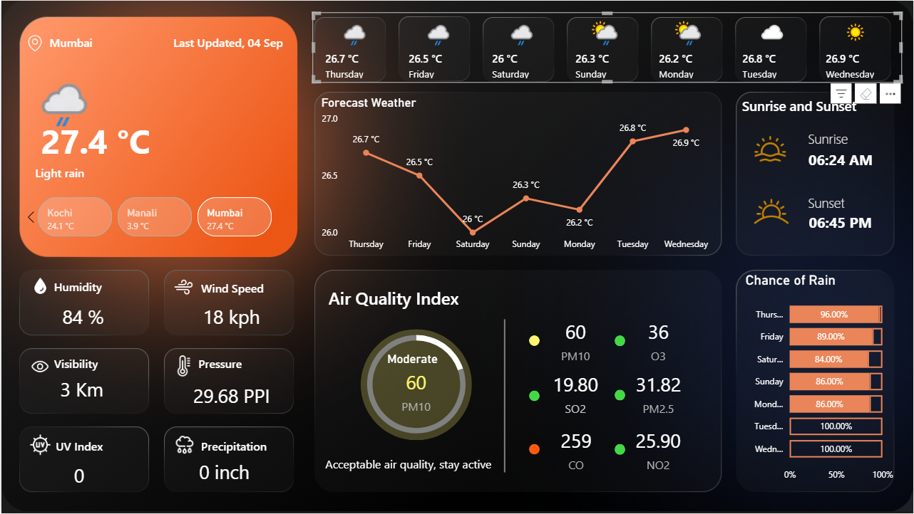
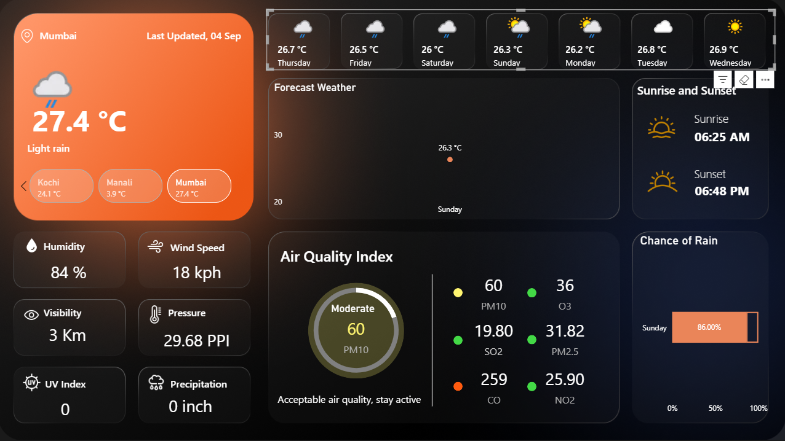
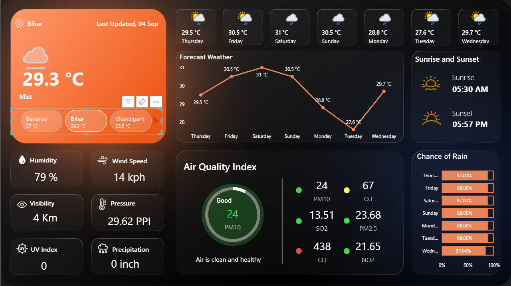

# 🌦️ Weather Dashboard (Power BI + WeatherAPI)

A **Power BI dashboard** powered by [WeatherAPI.com](https://www.weatherapi.com/) that displays **real-time weather updates, forecasts, air quality index, and environmental data** for any city.  
The dashboard is fully interactive — you can switch between cities, view detailed daily forecasts, and monitor live weather metrics in one place.



---

## ✨ Features

- 🌍 **City Selection**: Choose different cities and get real-time weather updates.
- 🌡️ **Live Weather Data**: Temperature, humidity, wind speed, visibility, and pressure.
- 📈 **Forecast Visualization**: 7-day forecast with trend chart.
- ☁️ **Air Quality Index (AQI)**: PM10, SO2, CO, O3, PM2.5, NO2 levels.
- 🌅 **Sunrise & Sunset Timings**: Location-specific daily updates.
- ☔ **Chance of Rain**: Percentage likelihood of precipitation for each day.
- 🔍 **Day-specific Insights**: Click on a weekday to see the detailed temperature trend for that day.

---

## 🛠️ Tech Stack

- **Power BI** — Dashboard design and interactivity.
- **WeatherAPI.com** — Live weather and forecast data.
- **Power Query (M Language)** — API calls and data transformations.
- **DAX** — Calculations for dynamic visuals.

---

## 🚀 Getting Started

### 1. Clone the repository
```bash
git clone https://github.com/your-username/weather-dashboard.git
cd weather-dashboard
```
### 2. Get your WeatherAPI key

Sign up at WeatherAPI.com
.

Generate your free API key.

### 3. Connect in Power BI

- Open the .pbix file in Power BI Desktop.

- Go to Transform Data → Advanced Editor.

- Replace the placeholder API key with your own key.
```
let Source = Json.Document(Web.Contents("http://api.weatherapi.com/v1/forecast.json?key=YOUR_API_KEY&q=Mumbai&days=7&aqi=yes&alerts=no"))
```
in Source
### 4. Refresh the Dashboard

Click Refresh in Power BI to fetch the latest weather data.

---

## 📊 Dashboard Highlights

Main Card → Current temperature & condition.

Forecast Section → 7-day temperature forecast with chart.

Air Quality Index → Gauge + pollutant levels.

Weather Metrics → Humidity, wind speed, visibility, pressure, UV index, precipitation.

Sunrise/Sunset → Daily timings.

Rain Probability → Bar chart for precipitation chance.

---

## 📸 Demo





---

## 🙌 Acknowledgements

- WeatherAPI.com for providing real-time weather data.

- Microsoft Power BI for powerful visualization tools.
